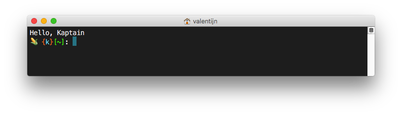

# I'm into the dotfiles now

For an asignment I had to dive in the command lines and get familiar with the terminal. So the first thing I wanted to do is changing some preferences to make it mmore workable. Down the readme I summed up what I did so far.

## The prompt
The standard prompt from mac os is actually not that usefull. It sometimes makes my shell unreadable. To solve that problem I wanted an output like this `<Name> <directory>` and distinct it with colors. With this solution you can read the screen mutch quicker. To start off I found an [article](http://osxdaily.com/2006/12/11/how-to-customize-your-terminal-prompt/) on OSXDaily that helped me with the basics. 

**And created this:**

`PS1="\u [\w] "`

**What gives me this:**

`valentijn [~]`

That's still not what I wanted yet. It could be more personel. I wantend to add some colors and even an emoticon. So I tought Youtube would give me a nice answer. And it did, Corey Schafer showed me how he did it in a [video](https://www.youtube.com/watch?v=LXgXV7YmSiU).

Eventually I displayed my logo with matching colors en showed in witch directory I'm in. See the result:



## Welcome message
I did not had a welcome message for my terminal. But i actualy didn't want a large one like cowsay. It's long and not that functional. So i wrote "Hello, Kaptain" in the `motd` file. And I also wanted to remove the last login notification. I don't need that to know each time. I made an empty `.hushlogin` file to remove the login notification and wrote a command in my `.bash_profile` to keep showing the `motd` file.

## Aliases
To make my terminal workable I made use of aliases in bash. It's a simple way to make it all easier. To know how this works I followed a [tutorial](https://www.digitalocean.com/community/tutorials/an-introduction-to-useful-bash-aliases-and-functions) from digitalocean.com. I made some handy aliases that would help navigate quicker tp certain directory's. 

Here are some examples:

```
# Going to the base directory
alias home="cd ~"

# Going quicker to directory of the course I follow
alias be="cd ~/documents/opleidingen/hogeschool\ amsterdam/jaar\ 4/backend"
``` 

And learned how to make a function and use multiple commands:

```
# Make Directory Move To
mdmt () {
    mkdir -p $1
    cd $1
}
```

## Recources
1. [Adjusting welcome message](http://www.mactricksandtips.com/2008/04/change-your-terminal-welcome-message.html)
2. [Removing last login](https://apple.stackexchange.com/questions/254690/remove-last-login-message-but-keep-motd-in-terminal)
3. [Colors for the prompt](https://jonasjacek.github.io/colors/)
4. [How to change the prompt](http://osxdaily.com/2006/12/11/how-to-customize-your-terminal-prompt/)
4. [Making some aliases](https://www.digitalocean.com/community/tutorials/an-introduction-to-useful-bash-aliases-and-functions)